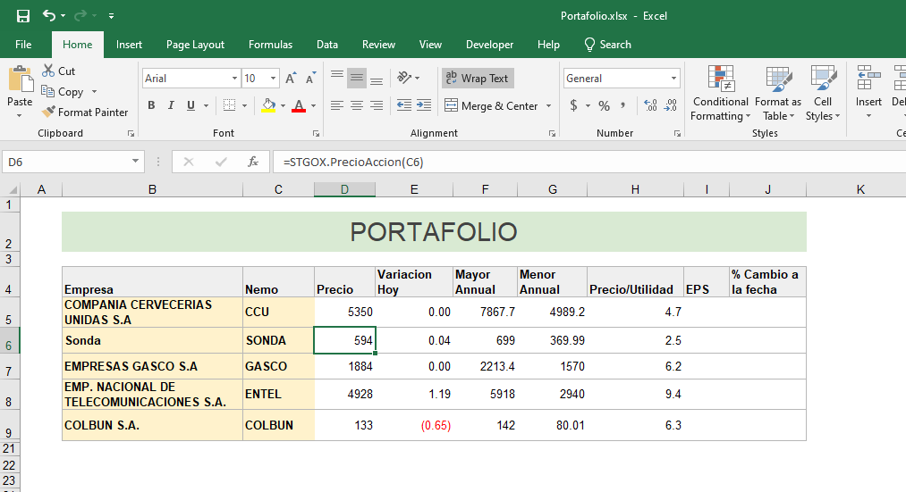

# xll-for-santiagox
Excel Add-in Bolsa Santiago Services.

## Como usar
### 1. Bajar BolsaSantiagoXll.xll
       Copiar extension al disco duro. Esta extension al momento es compatible con Excel de 64 bits
### 2. Configurar
  1. Copiar BolsaSantiagoXll.cfg en C:/users/user name/
  2. user_token = un user token valido provisto por STGOX
  

